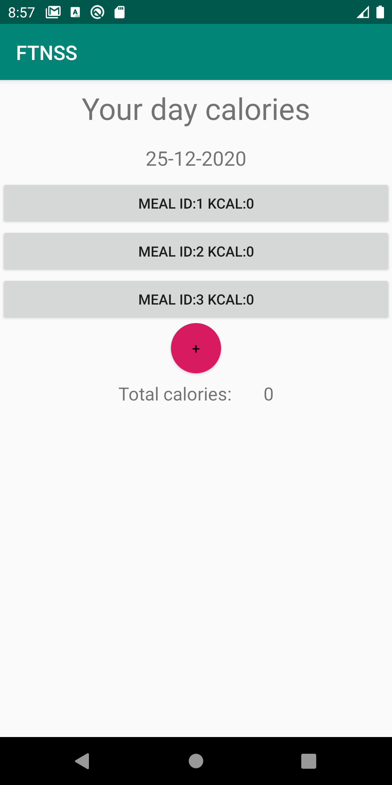
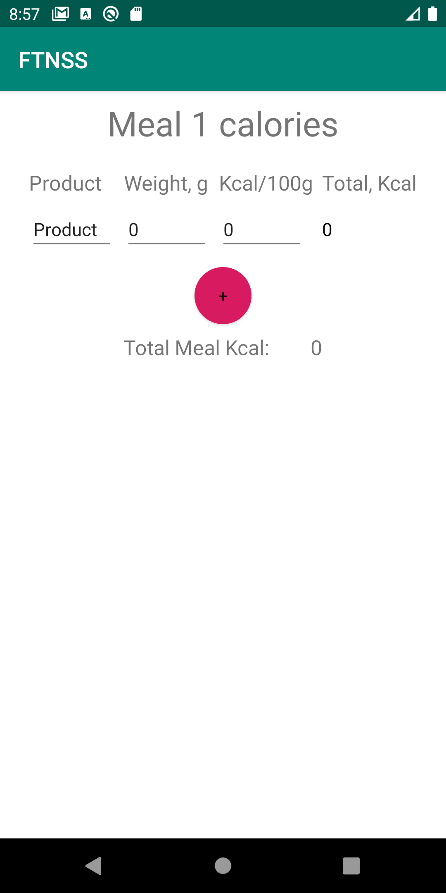

# FTNSS

Java sample project 

### Description
FTNSS app can help you to track your food consumption, in the most precise manual way.

Just write all the products you eat with their weight and calorific value and the app counts and saves it for you. 

### Features:
* Clean Architecture 
* MVP
* Room database
* RxJava

